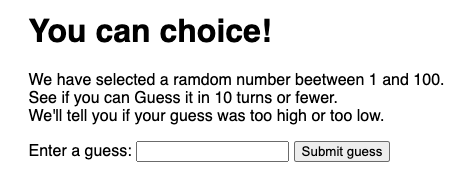

#  Life Style

### 서비스 소개
#### JavaScript를 공부하며 만든 간단한 '숫자 맞추기 Application' 입니다.

 
> 한국에선 흔하게 UP&DOWN 게임이라고 부르죠.

 

### 게임 설명
#### 숫자는 1에서 100 사이의 숫자 중에서 무작위로 선택됩니다.
1. 플레이어는 10번의 기회를 갖고 있어요.
2. 입력한 숫자가 맞았는지 틀렸는지 알리는 일은 당연해요.
3. 만약 틀렸다면 정답과 비교했을 때 `작나? 크나?`를 포함해서 알려줘요.
4. 추가로, 이전에 입력한 숫자들도 보여준답니다.
  
> 이 게임은 플레이어가 숫자를 맞추거나 기회를 모두 소진하면 끝나요. 게임이 끝나면 유저에게 다시 게임을 할 것인지 묻게됩니다.

 

### 작업 설명
1. 1에서 100 사이의 숫자 중 무작위로 추출한다.
2. 1부터 플레이어의 차례를 기록한다.
3. 플레이어에게 숫자를 맞출 수 있게 한다.
4. 숫자를 입력 한다면 어딘가에 저장하고, 사용자는 이전의 추측한 숫자를 볼 수 있도록 한다.
5. 숫자가 일치한지 확인한다.
6. 만약 일치한다면?
    - 축하한다는 메세지 표시
    - 게임을 다시 할 지 물음
7. 숫자가 틀렸고, 기회가 남았다면?
    - 틀렸다고 알리는 메세지 표시
    - 다른 숫자를 입력할 수 있도록 함
    - 기회 1소진, 또는 차례 1 증가
8. 숫자가 틀렸고, 기회가 없다면?
    - 게임이 종료되었다는 메세지를 표시
    - 더 이상 숫자를 맞출 필요 없음
    - 게임을 다시 할 지 물음
9. 게임이 재시작되면, 게임의 구조와 UI는 리셋되며, 처음부터 시작한다.